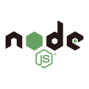

### Hi ! I'm Tmiracle 👋

I am a full-stack developer with a focus on front-end development. 

I am passionate about learning and exploring new technologies, and I hope to continue enhancing my skills in future projects while collaborating with the team to create outstanding products.

This is <a href="https://sunxuecong.github.io/github-actions-demo/" target="_blank">my blog</a> 👈👈👈

---

### My skills set

<!-- github-langs:start -->
<!-- prettier-ignore-start -->
<!-- markdownlint-disable -->
<!--  -->
<!-- markdownlint-restore -->
<!-- prettier-ignore-end -->
<!-- github-langs:end -->

#### Frontend and Frameworks

<!-- Frontend:start -->
<!-- prettier-ignore-start -->
<!-- markdownlint-disable -->
<code></code>
<code></code>
<code></code>
<code></code>
<code></code>

<code></code>

<code></code>
<code></code>
<code></code>
<code></code>
<code></code>
<code></code>
<code></code>
<code></code>
<code></code>
<code></code>
<!-- markdownlint-restore -->
<!-- prettier-ignore-end -->
<!-- Frontend:end -->

#### Backend、Databases and Frameworks

<!-- Backend:start -->
<!-- prettier-ignore-start -->
<!-- markdownlint-disable -->
<code></code>
<code></code>
<code></code>
<code></code>
<!-- markdownlint-restore -->
<!-- prettier-ignore-end -->
<!-- Backend:end -->

#### DevOps and Tools

<!-- DevOps:start -->
<!-- prettier-ignore-start -->
<!-- markdownlint-disable -->
<code></code>
<code></code>
<code></code>
<!-- markdownlint-restore -->
<!-- prettier-ignore-end -->
<!-- DevOps:end --> 

#### Learning

<!-- Learning:start -->
<!-- prettier-ignore-start -->
<!-- markdownlint-disable -->
<code></code>

<code></code>

<code></code>
<!-- markdownlint-restore -->
<!-- prettier-ignore-end -->
<!-- Learning:end -->

---

### Interested

<!-- Interested:start -->
<!-- prettier-ignore-start -->
<!-- markdownlint-disable -->
<code></code>

<code></code>
<code></code>
<code></code>
<code></code>
<code></code>
<code></code>
<!-- markdownlint-restore -->
<!-- prettier-ignore-end -->
<!-- Interested:end -->

